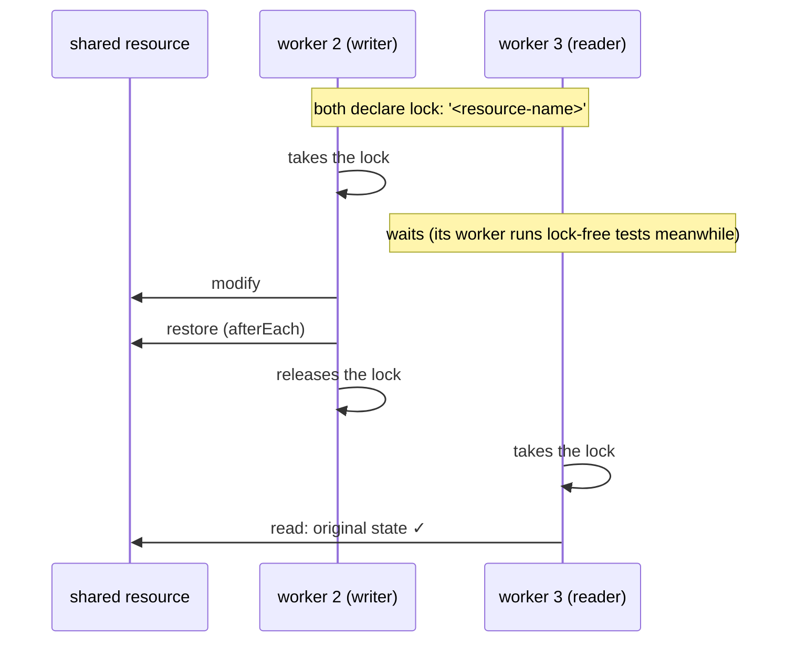

# Playwright test locks — what we learned and where it lives in the kit

Test locks shipped in **Playwright 1.63** (September 2026). This document records the research done in [`playwright-lock-demo`](https://github.com/JoanEsquivel/playwright-lock-demo) (a tutorial repo with a real race, the fix and a CI workflow) and maps every piece of it to the agent kit. The operational guide for agents is the `playwright-locks` skill; this page is the human-readable version with the evidence.

> This repository ships **no** locked test on purpose: its example targets have no genuinely shared mutable resource (decision 12 in [`decisions.md`](decisions.md)). `@playwright/test` is pinned at 1.63.0, so `lock` is available the day a real target needs it.

## 1. The feature in one minute

Playwright runs tests in parallel worker processes. That breaks when two tests need the *same thing* at the same time: one seeded account, one global setting, one external sandbox. Since 1.63 a test can name the shared thing:

```ts
test('should rename the user', { lock: 'user-settings' }, async ({ page }) => {});
test.describe('Account settings', { tag: ['@e2e'], lock: 'seeded-account' }, () => {});
test('should reset account and sandbox', { lock: ['seeded-account', 'payment-sandbox'] }, async () => {});
```

> Tests that share a lock name never run concurrently, across files, workers and projects, while everything else keeps running in parallel. — 1.63.0 release notes
>
> Playwright acquires all the locks of a test before the test starts and releases them when it finishes. — docs

```
              time ─────────────────────────────────────────────────▶
worker 0   [ A ]      [ C ]
worker 1   [ B ]
worker 2   [ D: change the account ...................... ][ E: read ✓ ]      D and E hold lock 'account'
worker 3   (takes other lock-free tests meanwhile)
```

Without the lock, E starts while D is half-way and fails for a reason that has nothing to do with the application. That is the difference between a lock and `workers: 1`: you pay the serialisation only where the sharing is.

## 2. Semantics (verified)

Checked against `types/test.d.ts` and the runner source of `playwright@1.63.0`, plus measured runs.

- `lock?: string | string[]` is a key of the details object, next to `tag` and `annotation`; accepted by `test()` and `test.describe()` and their variants.
- A lock is just a **name**. Nothing to register. Same name → take turns; different or no name → unaffected. Applies across files, workers and **projects**.
- A test's locks are its own plus those of every enclosing `describe`. `['a', 'b']` waits until all are free.
- Held for the **whole test**, fixtures and hooks included: the browser context (and its `storageState` file) is created inside the lock, and `afterEach` runs before release. Measured: the next holder started 6 ms after the previous one ended.
- **Exclusive** mutex, not read/write: readers holding the same name also serialise against each other.
- The scheduler keeps held locks **in the memory of the runner process**. A free worker takes the first queued job whose locks are free and skips the rest, so a waiting test does not occupy a worker.
- The unit that holds the lock is the *job* (tests that must run together):

  | Mode | Lock is held for |
  |---|---|
  | `fullyParallel: true` (kit standard) | each test |
  | default file mode | the whole file, if any test in it declares a lock |
  | `describe.configure({ mode: 'serial' })` | the serial group |
  | `beforeAll`/`afterAll` present | a chunk of the file |

- `testInfo.parallelIndex` is the stable worker slot; `workerIndex` grows on every worker restart. Use the first in timelines.

## 3. When to use it

Ask in this order: **can I remove the sharing? → can I make it read-only for most tests? → only then, lock it, on every participant.**

| Situation | Do this |
|---|---|
| Tests only read a shared thing | No lock. Reads do not conflict. |
| Each test could use its own copy (user, record, file, `.auth/<role>.json`) | Make it unique per test/role. Better than any lock. |
| One thing you cannot duplicate: seeded account, global setting, one-slot sandbox, rate-limited API | `lock` on every test that touches it. |
| Several such things | `lock: ['a', 'b']`. |
| Shared across CI jobs or shards | A lock will not help. Partition the resource or coordinate outside Playwright. |
| Tests depend on each other's results | Redesign. Locks control access, not sequence. |
| Every test mutates the same global state | Serial (`--workers=1`). |

Compared with the older workarounds: `--workers=1` makes the whole suite pay; `describe.serial` only works inside one file and couples the tests; sleeps and retries make the failure rarer, not gone.

Review questions before approving a lock: could it be unique per test? Is it shared only inside one run or across CI jobs too? Would locking cancel the benefit of sharding? Is it a real external resource or hidden test coupling? Should CI allocate one account per shard instead?

## 4. Things that bite

1. **Everyone must opt in.** A test that touches the resource without the lock is invisible to the scheduler. *This happened in the demo's own first version:* the public-page specs inherited the project `storageState` and read the shared file without the lock. Fix: tests that do not need the resource start without it (`test.use({ storageState: { cookies: [], origins: [] } })`).
2. **A lock is not cleanup.** *Also a real bug in the first version:* the writer restored the resource only at the end of the test body, so a crash poisoned the rest of the run. Fix: snapshot in `beforeEach`, restore in `afterEach` (runs on failure, still inside the lock).
3. **File mode changes the granularity** (table above). The tutorial's first wording of the `beforeAll` case was wrong and had to be corrected: verify against the docs or the source.
4. **A lock is not an order.** Dependencies belong in a setup project or a fixture.
5. **A lock lives inside one run** (section 6).
6. **Retries hide races.** With `retries: 2` a collision passes on retry and nobody learns about it.
7. **One race, several symptoms:** `Expected: "Casey Customer" Received: "Alex Admin"`, `Expected: hidden Received: visible`, and `Error reading storage state from .auth/user.json: Unexpected end of JSON input` (a torn read while the writer was writing). All look like application bugs. None is.
8. **Writers never fail, readers do** — often in another file.
9. **Few workers and fast machines hide it.** `ubuntu-latest` runs 2 workers by default; the laptop collided 1 of 9 readers, the slower CI runner 5 of 9.
10. **It may not reproduce on a given run.** Raise `--repeat-each` and workers.

## 5. Local workflow: prove the race, prove the fix

```bash
# 1. red without the lock: retries off, real overlap, repeated
pnpm exec playwright test <writer.spec> <reader.spec> --workers=4 --repeat-each=3 --retries=0
# 2. add { lock } to every participant + afterEach restore in writers
# 3. green under stress, several times
pnpm exec playwright test --workers=4 --repeat-each=2 --retries=0
```

For a tutorial or a race that must stay demonstrable, the demo keeps lock-free **copies** of the two specs in `tests/demo/race/` (no project of the main config points there) and a second config, `playwright.race.config.ts`, that spreads the base config and sets `retries: 0`, `workers: 4`, `repeatEach: 3` on the project, `trace: 'retain-on-failure'` and no `github` reporter. Scripts: `demo:race` (expected to fail) and `demo:locks` (must be green). A small `auto` fixture prints a timeline so the overlap is visible:

```text
23:17:40.427 ▶ start  [worker 3] should take over the shared session as admin … (run 3)
23:17:41.184 ▶ start  [worker 2] should show the customer name in the header (run 3)      ← starts while a writer holds the file
23:17:46.987 ■ end    [worker 2] should show the customer name in the header (run 3) → failed
```

With the lock, the three lock-free public tests ran in parallel with the writer, the first reader started 6 ms after the writer ended, and the run took the same time.



## 6. CI/CD

**A test lock is a mutex inside one `playwright test` process. It is not a distributed lock.**

| CI shape | Locks work? |
|---|---|
| One job, any workers; several projects/browsers in one invocation | yes |
| Sharded matrix (`--shard=i/n`), browser matrix as separate jobs | no |
| Two workflow runs at once, or a colleague running locally against the same environment | no |

Evidence, from the demo's first iteration (deleted from the working tree, kept in history: `git show b22e218:docs/PLAYWRIGHT_SHARDING_AND_LOCK.md`): two tests with `{ lock: 'shared-account' }`, each taking an atomic `mkdir` as the resource. In one invocation with 4 workers both acquired it ~900 ms apart. Launched as `--shard=1/2` and `--shard=2/2` together: `1 failed, 1 passed`, `Shard exit codes: 0, 1`. Same tests, same name; only the process boundary changed.

What to do instead, in order: unique per test (`testInfo.testId`) → one resource per worker or shard → idempotent operation → run the locked tests in one non-sharded job → a `concurrency:` group to queue whole runs per environment → an external lock service. (The fourth and fifth are kit guidance; they were not measured in the demo.)

The demo's workflow `playwright-locks.yml` runs two jobs on separate runners:

| Job | Runs | Real result (PR #1, run 34789444329) |
|---|---|---|
| Without locks (expected to fail) | `demo:race` with `continue-on-error`, outcome written to `$GITHUB_STEP_SUMMARY`, no `github` reporter | green job, red step: `5 failed, 8 passed (33.0s)`, three different symptoms |
| With locks (must be green) | `demo:locks` = `--workers=4 --repeat-each=2 --retries=0` | `15 passed (30.0s)` |

Take-aways for product pipelines: never keep an expected-to-fail job; keep the idea of the second one (a stress run with retries off); remember that `retries: CI ? 2 : 0` hides contention in normal runs; a second role means a second pair of secrets.

## 7. About the demo's scenario (do not copy it)

The demo target keeps all state in `localStorage`, so nothing on the site is shared between workers. To have *something* to lock, the demo shares **one** storage-state file between customer readers and an admin writer that overwrites it mid-run. That contradicts this kit's rule (one `.auth/<role>.json` per role, written once by setup, only read afterwards) and is flagged as a teaching prop in the demo's README, `AGENTS.md` and decisions. Take home the mechanics of `lock`, not the shared file. The first iteration used an even more synthetic resource (a directory created with `mkdir`) and was rewritten because one believable scenario teaches better than five abstract ones.

## 8. Where this lives in the kit

| Piece | File |
|---|---|
| Procedure for agents (decide → declare → restore → prove → CI) | `.claude/skills/playwright-locks/SKILL.md` |
| Semantics, decision guide, pitfalls, reproduce/verify, CI | `.claude/skills/playwright-locks/references/*.md` |
| Race config, timeline fixture, crash-safe writer spec, two-job workflow | `.claude/skills/playwright-locks/templates/*` |
| Decision tables ("Shared resources and locks", "Parallelism") | `.claude/skills/playwright-architecture/references/decision-tables.md` |
| Serial vs lock, locks vs shards | `.claude/skills/playwright-ci/SKILL.md`, `references/strategy-guide.md` |
| `contention` failure class | `.claude/skills/playwright-fix-test/SKILL.md`, `references/failure-taxonomy.md` |
| Shared-resource check when creating; lock clean-up when deleting | `playwright-create-test`, `playwright-delete-test` |
| Always-on contract (rule 8, test-style table, skills table) | `AGENTS.md`, scaffold `templates/common/AGENTS.md` |
| Path rules (mirrored to Cursor and Copilot by `pnpm sync:agents`) | `.claude/rules/tests.md`, `.claude/rules/ci.md` |
| Agent routing, gate and memory | `.claude/agents/qa-playwright-engineer.md`, `.claude/agent-memory/qa-playwright-engineer/test-locks-learnings.md` |
| Permission to run the skill unattended | `.claude/settings.json` (`Skill(playwright-locks)`) |
| Decision record | `docs/decisions.md` §12 |
| Prompts and troubleshooting | `docs/agent-guide.md` |

## 9. References

- Playwright docs — [Test locks](https://playwright.dev/docs/test-parallel#test-locks), [Parallelism](https://playwright.dev/docs/test-parallel), [Authentication](https://playwright.dev/docs/auth)
- [Playwright 1.63.0 release notes](https://github.com/microsoft/playwright/releases/tag/v1.63.0)
- [playwright-lock-demo](https://github.com/JoanEsquivel/playwright-lock-demo) — tutorial, specs, race config, workflow; first iteration (cross-shard experiment, peer-review notes) at commit `b22e218`
