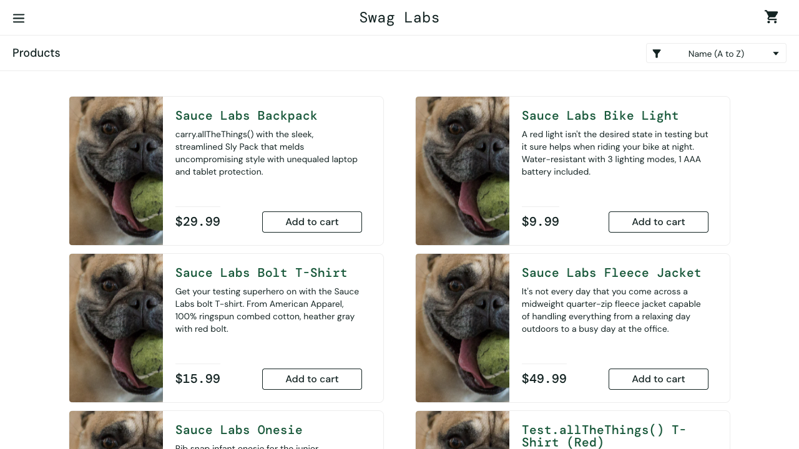
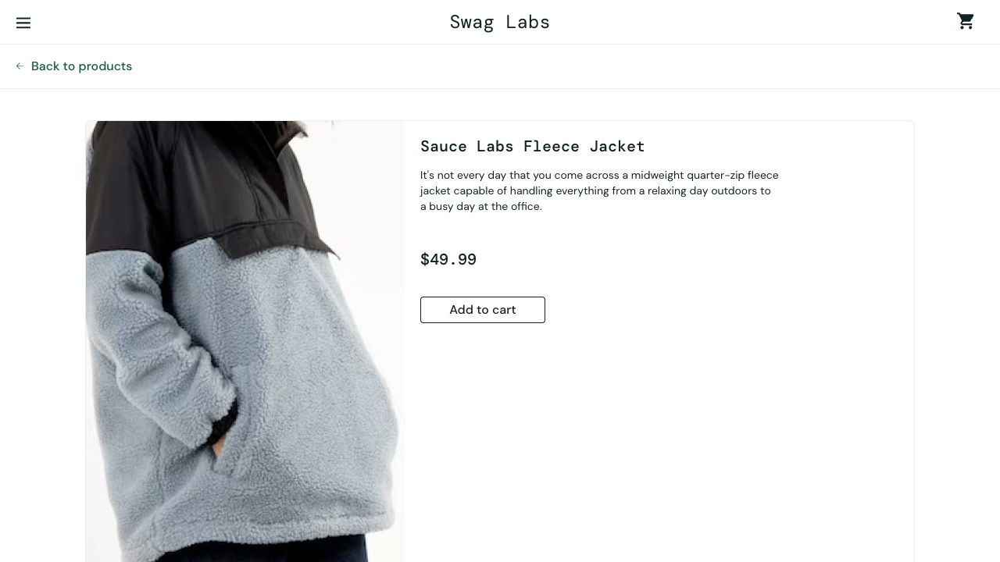

# Playwright UI Automation Framework

A end-to-end testing framework built with Playwright covering the critical purchase flow on SauceDemo (Swag Labs).

---

## Prerequisites

- [Node.js](https://nodejs.org/) v18 or higher
- [pnpm](https://pnpm.io/) v10.17.0 (declared in `package.json` as `packageManager`)
- A `.env` file at the root with the following variables:

```
email=${validEmail}
password={validPassword}
```

> Credentials are loaded via `dotenv` in `playwright.config.js` and accessed through `process.env` — never hardcoded in tests.

---

## Installation

```bash
# Install dependencies
pnpm install

# Install Playwright browsers
pnpm exec playwright install --with-deps
```

---

## Running Tests

### Headless (default) 
Runs all tests across all configured browsers without opening a UI.
```bash
pnpm exec playwright test
```

### Headed (watch the browser)
Opens a real browser window so you can see what's happening step by step.
```bash
pnpm exec playwright test --headed
```

### UI Mode (interactive)
My go-to for debugging. Opens Playwright's built-in test runner UI where you can pick tests, inspect steps, view traces, and watch the browser side by side.
```bash
pnpm exec playwright test --ui
```

### Specific file or folder
```bash
# Run only E2E tests
pnpm exec playwright test tests/e2e

# Run a specific spec
pnpm exec playwright test tests/e2e/saucedemo-critical-path.spec.js

# Run on a specific browser
pnpm exec playwright test --project=chromium
```

### View the HTML report
After a test run, open the report to inspect results, traces, and screenshots.
```bash
pnpm exec playwright show-report
```

---

## Architecture

I went with a classic Page Object Model structure, but with a few conventions I picked up that keep things clean and scalable.

```
playwright-for-ui/
├── pages/              # One class per page — locators and actions only
├── utils/
│   └── e2e.js          # Orchestrates multi-page flows (login, full purchase, etc.)
├── fixtures/
│   ├── page.fixtures.js    # Wires each page object into Playwright's fixture system
│   ├── e2e.fixtures.js     # Wires the E2E utility class
│   └── index.fixtures.js   # Single export point — all specs import from here
├── tests/
│   ├── *.spec.js           # Single-page tests (login, forms, etc.)
│   └── e2e/*.spec.js       # Multi-page end-to-end flows
├── data/
│   └── checkout-data.json  # Test data — no credentials, no hardcoded values in tests
└── .env                    # Local credentials — gitignored
```

### The core idea

**Page objects only interact, tests only assert.** That's the rule I follow strictly. Page objects expose locators and action methods, but they never run `expect()`. All assertions live in the spec file. This makes it really easy to see at a glance what a test is verifying without digging into multiple files.

**Fixtures wire everything together.** Instead of instantiating page objects inside tests, each class is registered as a Playwright fixture. Tests just declare what they need as parameters and Playwright handles the rest. All specs import from `fixtures/index.fixtures.js` — a single source of truth — so swapping something out later only requires changing one file.

**E2E utility for multi-page flows.** When a test spans multiple pages (like the full purchase flow), I use `utils/e2e.js` to orchestrate those steps. `e2e.login()` for example handles the full login sequence and acts as a bridge guard — confirming you actually landed on the inventory page before the test continues. This keeps `beforeEach` blocks clean.

**Locators use semantic selectors.** I prioritize `getByRole()` and `data-test` attributes over CSS classes or XPaths. They're less brittle when the UI changes and they communicate intent — `page.getByRole('button', { name: 'Checkout' })` tells you exactly what it's clicking without needing a comment.

**Test data lives in `/data`**, not in the test itself. Anything that could change (names, postal codes) goes in a JSON file. Credentials stay in `.env`.

---

## Manual QA Bug Report

**Exploratory session conducted with user:** `problem_user`

---

### BUG-001 — Product image links navigate to the wrong product detail page

**Title:** `problem_user` — Clicking a product image on the inventory page opens an unrelated product's detail page

**Description:**
When logged in as `problem_user`, clicking the image of any product on the inventory page does not navigate to that product's detail page. Instead, it redirects to a different, unrelated product. For example, clicking the Sauce Labs Backpack image opens the Sauce Labs Fleece Jacket detail page. This means users cannot reliably view product details by clicking the product image, breaking a core browsing interaction.

**Steps to Reproduce:**
1. Go to `https://www.saucedemo.com` and log in with username `problem_user` / password `secret_sauce`.
2. On the inventory page, locate the **Sauce Labs Backpack** product card.
3. Click the **product image** (not the product title link).

**Expected Result:**
The user is taken to the detail page for the Sauce Labs Backpack (`/inventory-item.html?id=4`), showing its name, description, price, and image.

**Actual Result:**
The user is redirected to the Sauce Labs Fleece Jacket detail page (`/inventory-item.html?id=5`) — a completely different product.

**Evidence:**

Inventory page — all product images show the same dog photo, and the Backpack image link is misrouted:


Product detail page opened after clicking the Backpack image — shows Fleece Jacket instead:


**Severity:** High — the image is a primary clickable affordance on every product card. Misrouting users to the wrong product undermines trust, can lead to unintended purchases, and degrades the core shopping experience for this user type.

**Environment:** SauceDemo (`https://www.saucedemo.com`), user `problem_user`, tested on Chromium via Playwright.
