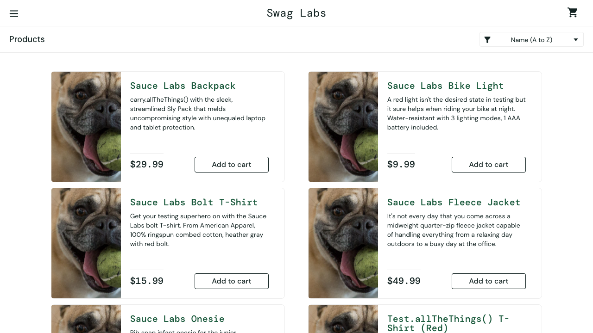
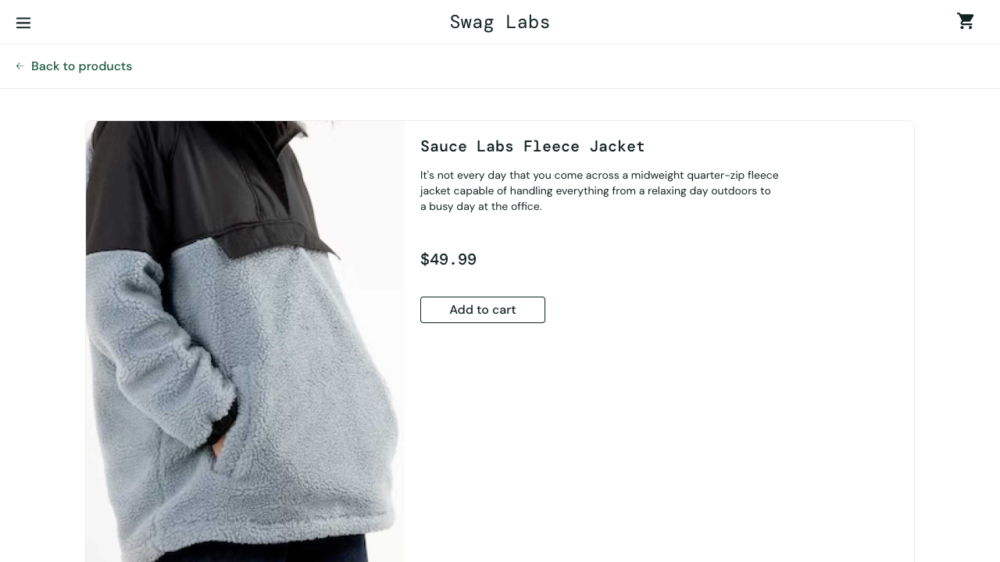

# Playwright Standards — Reference Implementation

This repository is the **reference implementation** of a Playwright standards kit and, at the same time, the kit itself (agent, skills and rules under `.claude/`). The UI target (SauceDemo) and the API target (DummyJSON) are **examples only**: every URL and credential comes from `.env`, so the same structure applies to any application.

- Architecture rules: `AGENTS.md` (portable, read by Claude Code, GitHub Copilot and Cursor)
- Agent skills: `.claude/skills/` · QA agent: `.claude/agents/qa-playwright-engineer.md` (Copilot mirror in `.github/agents/`)
- Path-scoped rules: `.claude/rules/` → mirrored to `.cursor/rules/` and `.github/instructions/` by `pnpm sync:agents`
- Design, plans and decisions: `docs/`

---

## Prerequisites

- Node.js ≥ 20.11 (Node 24 recommended)
- pnpm 10 via Corepack: `corepack enable` (or prefix commands with `corepack pnpm`)
- A `.env` file created from `.env.example`

```bash
cp .env.example .env   # then edit the values for your targets
```

## Installation

```bash
pnpm install
pnpm exec playwright install chromium --with-deps
```

## Running tests

| Command | What it runs |
|---|---|
| `pnpm test` | Every project: `setup` → `ui`, `e2e`, plus `api` |
| `pnpm test:ui` | Single-page UI specs (`tests/ui`) |
| `pnpm test:api` | API specs (`tests/api`), no browser |
| `pnpm test:e2e` | Multi-page flows (`tests/e2e`), authenticated via storage state |
| `pnpm test:smoke` | Only tests tagged `@smoke` |
| `pnpm test:headed` | Watch the browser |
| `BROWSERS=chromium,firefox,webkit pnpm test` | Adds `ui-firefox`, `e2e-webkit`, … projects |
| `WORKERS=1 pnpm test` | Serial run |
| `pnpm report` | Open the last HTML report |

### Debugging with Playwright CLI

```bash
pnpm test:debug tests/ui/login.spec.ts   # pauses and prints a session name
pnpm exec playwright-cli attach <session> # then: snapshot, console error, requests, pause-at, step-over, resume
```

## Project layout

```
pages/        Page objects — locators + actions, never assertions
api/          clients/ (HTTP calls, raw responses) · schemas/ (zod)
utils/        e2e.ts (multi-page flows, bridge guards) · env.ts
fixtures/     page / e2e / api fixtures → index.fixtures.ts (single import for specs)
tests/        setup/ · ui/ · api/ · e2e/
data/         JSON test data (no credentials)
```

## Using the QA agent

```bash
claude --agent qa-playwright-engineer            # Claude Code
# Copilot: /qa-playwright-engineer in VS Code or `copilot --agent qa-playwright-engineer`; Cursor: AGENTS.md + skills load automatically
```

Ask for any of: create a framework from zero in another directory, add UI/API tests for a URL or endpoint, fix a failing test, delete tests, set up serial/parallel/sharded CI, protect a shared resource with test locks. Invocation per tool and recommended prompts: `docs/agent-guide.md`.

## Shared resources and test locks

Tests here own the data they change, so the suite needs no lock. When a target has something tests cannot duplicate (one seeded account, a global setting, a one-slot sandbox), Playwright 1.63+ test locks serialise only the tests that touch it:

```ts
test.describe('Account settings', { tag: ['@e2e', '@locked'], lock: 'seeded-account' }, () => { /* … */ });
```

Every participant declares the same name, writers restore the resource in `afterEach`, and the fix is proven with `pnpm exec playwright test --workers=4 --repeat-each=2 --retries=0`. Locks live inside one `playwright test` run: they do not cross shards or CI jobs. Full write-up with the measured race, pitfalls and CI guidance: [`docs/test-locks.md`](docs/test-locks.md); agent procedure: `.claude/skills/playwright-locks/`; runnable tutorial: [playwright-lock-demo](https://github.com/JoanEsquivel/playwright-lock-demo).

## Quality gates

- `pnpm sync:agents:check` — generated Cursor/Copilot files match `.claude/rules` and `.claude/agents`.
- `pnpm lint` — ESLint (`eslint-plugin-playwright`, typescript-eslint) + `tsc`. Architecture rules are enforced by lint: no assertions in `pages/` or `api/`, specs import only from the fixtures index, no `page.goto()` in specs, no hard-coded credentials, no `waitForTimeout`, no conditionals in tests.

## Continuous integration

| Workflow | Trigger | Strategy |
|---|---|---|
| `lint.yml` | push / PR | ESLint + typecheck |
| `playwright-parallel.yml` | push / PR / manual | Default workers; `@smoke` on PRs, full suite on push |
| `playwright-serial.yml` | manual | `--workers=1` for rate-limited targets or suites where everything shares state (a few colliding tests: use test locks instead) |
| `playwright-sharded.yml` | nightly / manual | 4 shards + blob reports merged into one HTML report |

Required repository secrets: `E2E_USERNAME`, `E2E_PASSWORD`, `API_USERNAME`, `API_PASSWORD`. Optional variables: `BASE_URL`, `API_BASE_URL` (default to the example targets).

---

## Manual QA Bug Report

**Exploratory session conducted with user:** `problem_user`

---

### BUG-001 — Product image links navigate to the wrong product detail page

**Title:** `problem_user` — Clicking a product image on the inventory page opens an unrelated product's detail page

**Description:**
When logged in as `problem_user`, clicking the image of any product on the inventory page does not navigate to that product's detail page. Instead, it redirects to a different, unrelated product. For example, clicking the Sauce Labs Backpack image opens the Sauce Labs Fleece Jacket detail page. This means users cannot reliably view product details by clicking the product image, breaking a core browsing interaction.

**Steps to Reproduce:**
1. Go to `https://www.saucedemo.com` and log in with username `problem_user` / password `secret_sauce`.
2. On the inventory page, locate the **Sauce Labs Backpack** product card.
3. Click the **product image** (not the product title link).

**Expected Result:**
The user is taken to the detail page for the Sauce Labs Backpack (`/inventory-item.html?id=4`), showing its name, description, price, and image.

**Actual Result:**
The user is redirected to the Sauce Labs Fleece Jacket detail page (`/inventory-item.html?id=5`) a completely different product.

**Evidence:**

Inventory page — all product images show the same dog photo, and the Backpack image link is misrouted:


Product detail page opened after clicking the Backpack image — shows Fleece Jacket instead:


**Severity:** High — the image is a primary clickable affordance on every product card. Misrouting users to the wrong product undermines trust, can lead to unintended purchases, and degrades the core shopping experience for this user type.

**Environment:** SauceDemo (`https://www.saucedemo.com`), user `problem_user`, tested on Chromium via Playwright.
